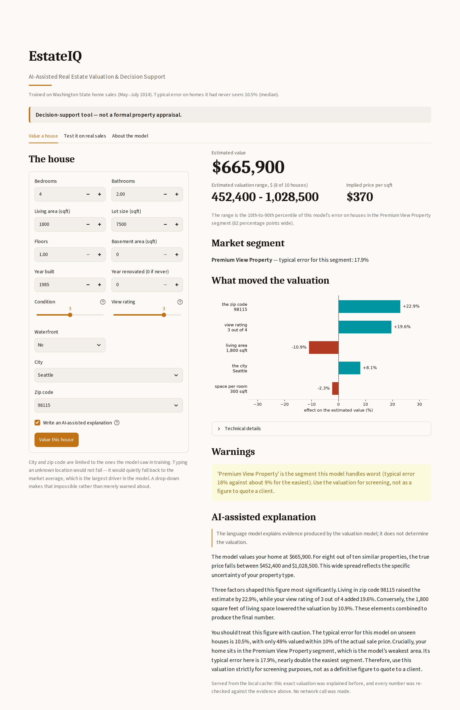

# Real Estate Machine

A house-price valuation system for the King County (WA) residential market: it segments the
market, predicts a sale price, states how confident it is, and explains the number in plain
language a buyer or an agent can act on.

The app built in this project is **EstateIQ** — *AI-Assisted Real Estate Valuation & Decision Support*.
It is a decision-support tool, not a formal property appraisal.

**Typical error: 10.5%** on unseen sales — against 21.0% for the zipcode-median rule the
industry uses as a sanity check.

| | |
|---|---|
| **Live app** | [real-estate-machine-esraa.streamlit.app](https://real-estate-machine-esraa.streamlit.app/) |
| **Kaggle notebook** | [Real Estate Machine: House Price Valuation](https://www.kaggle.com/code/esraamaamoun/real-estate-machine-house-price-valuation) |
| **Data** | 4,600 King County sales, 2014–2015 (Kaggle House Data) |
| **Final model** | Gradient Boosting Regressor — R² 0.863, MedAPE 10.54% |



---

## What problem this solves

Ask three people what a house is worth and you get three numbers and no reasoning. The rule of
thumb most buyers fall back on — median price per square foot in the zipcode — is wrong by
about 21% on a typical house, because it ignores condition, view, size and the difference
between two streets in the same zipcode.

This project replaces that rule with three things:

1. **A price** — a gradient-boosted model trained on 3,476 sales, wrong by about 10.5% on a
   typical house it has never seen.
2. **A range, not a point** — every prediction ships with a 10–90 interval (−20.1% / +26.4%),
   because a valuation stated to the dollar is a valuation pretending to a precision it
   does not have.
3. **A reason** — SHAP computes which features moved the price and by how much; a language
   model turns that arithmetic into sentences. Every number in the generated text is checked
   against the model's own output before it is shown.

---

## Quickstart

```powershell
python -m venv venv
venv\Scripts\activate
pip install -r requirements.txt
streamlit run app/app.py
```

The app opens at `http://localhost:8501`. It runs without an API key — the explanation layer
falls back to a deterministic template. To enable the language layer, copy `.env.example` to
`.env` and add a Gemini or Groq key.

### Rebuilding the model

```powershell
python -m src.train           # train, evaluate, self-check — writes nothing
python -m src.train --save    # ... and rebuild Models/*.pkl
python -m src.train --tune    # re-derive the hyperparameters by grid search
```

`src/train.py` rebuilds every model artefact from `Data/data_clean.csv` in about five
seconds, and checks its own output against the numbers recorded during development — it
exits non-zero if they have drifted. The notebooks are the record of *how* the model was
chosen; this is how the result is reproduced.

---

## Repository map

```
├── app/                 the product — importable modules, not notebook code
│   ├── app.py             Streamlit interface
│   ├── preprocessing.py   feature engineering + encoders (the same file that trained the model)
│   ├── explain.py         evidence layer — SHAP, comparables, warnings
│   ├── llm_explain.py     language layer — writes the sentences, verifies every number
│   ├── charts.py          the price-driver chart
│   └── requirements.txt   the trimmed 9-package list the cloud installs
│
├── src/
│   └── train.py           one-command rebuild of every model artefact, with a self-check
│
├── Notebooks/           the analysis record, 01 → 12, in order
├── Models/              trained artefacts (.pkl) — committed, so the cloud app need not retrain
├── Data/                raw and processed data, plus the fixed train/test split
├── reports/             business report, figures, defence deck
├── scripts/             figure and deck builders, verification scripts
└── requirements.txt     the full development environment
```

**Reusable code lives in `app/`, not in the notebooks.** The notebooks import it. That is
deliberate: it is what lets `joblib` un-pickle the saved models, and what lets the app call
exactly the same feature engineering that produced them. A feature computed one way in
training and another way in production is the most common way a working model silently
starts lying.

---

## How to read the notebooks

Run them in order; each one saves what the next one loads.

| Notebook | What it establishes |
|---|---|
| `01_data_understanding` | What the 21 columns are, what is missing, what is impossible |
| `02_cleaning` | Zero-price rows, duplicates, outlier policy → `data_clean.csv` |
| `03_eda_distributions` | Price is log-normal; the transform that follows from that |
| `04_eda_relationships` | What actually drives price — and what only appears to |
| `05_features` | Engineered features, target encoding, the fixed train/test split |
| `06_clustering` | K-Means, k=4 → four named market segments |
| `07_classification` | A classifier that recovers the segment from raw inputs (98.7% accuracy) |
| `08_regression` | Linear/Ridge/Lasso baseline — R² 0.827, MedAPE 12.5% |
| `09_model_tuning` | RF / GB / XGB tuned; GB wins on the IAAO ratio study |
| `10_llm_explanation` | SHAP → grounded natural-language explanation |
| `11_streamlit_app` | The interface, built on the modules in `app/` |
| `12_deployment` | Pre-flight checks before the repository goes public |

`kaggle_real_estate_machine.ipynb` is a standalone condensed version of the whole pipeline
that runs top to bottom on Kaggle's servers.

The business findings live in **`reports/business_insights.md`** (and as a typeset PDF beside
it), written from the `03`/`04` figures — there is no notebook for that step because its
deliverable is the report.

---

## Results

### Market segments (K-Means, k=4, silhouette 0.255)

Established Family Home · Compact Entry-Level · Premium View Property (7.9%) ·
New-Build Suburban Family

A logistic regression recovers the segment from raw inputs at 98.7% accuracy — it beats a
random forest here because K-Means boundaries *are* linear hyperplanes, so the linear model
is the correctly specified one.

### Price model — test set, 869 unseen sales

| Model | R² | MedAPE | MAPE | Within ±10% |
|---|---|---|---|---|
| Zipcode-median rule | 0.53 | 21.0% | — | — |
| Ridge baseline | 0.827 | 12.52% | 16.83% | 41.0% |
| RF (tuned) | 0.847 | 11.30% | 14.98% | 45.7% |
| XGB (tuned) | 0.867 | 10.78% | 14.38% | 47.0% |
| **GB (tuned) — shipped** | **0.863** | **10.54%** | **14.58%** | **47.9%** |

GB and XGB are statistically indistinguishable on error (difference −0.18 pp, bootstrap CI
[−0.72, +0.49], Wilcoxon p = 0.20). The tie is broken on the **IAAO ratio study**, the
standard appraisal authorities use: GB is the only model that passes all three tests
(ratio 0.998, COD 14.61, PRD 1.030 — Ridge fails COD, RF and XGB fail PRD).

### What drives the price

Location dominates: target-encoded zipcode first, then living area, then city. Permutation
importance ranks `city` third where impurity importance ranks it fourth — worth knowing which
question each measure answers. Five features carry zero importance and are kept only for the
interface: floors, renovation flag, basement flag, bedrooms, bathrooms-per-bedroom.

---

## Known limitations

Stated because a valuation model that hides its failure modes is worse than one that has
none.

- **The top decile is under-valued by 11.5%**, and this got *worse* when the project moved
  from Ridge to gradient boosting (−7.2% → −11.5%). Trees cannot extrapolate beyond the
  prices they were trained on. It is also what pushes PRD to the edge of its acceptable band.
- **The cheapest decile is over-valued** by roughly 12%.
- **Premium View Property** carries about twice the error of the other segments (17.9%) — it
  is the smallest segment at 7.9% of sales, and view is the hardest attribute to quantify.
- **No time trend is modelled.** The data spans one year in one county; the model is a
  cross-sectional snapshot, not a forecast.
- **Renovation looks worth 23% raw, ~10% like-for-like.** The raw figure is confounded by
  which houses get renovated.

---

## Built with

Python · pandas · scikit-learn 1.9.0 · XGBoost · SHAP · Streamlit · Gemini / Groq

`scikit-learn` is pinned to 1.9.0, in both requirements files: every model file the app loads
was saved by 1.9.0, and un-pickling under a different version is a warning you do not want
in a deployed valuation model. `Models/cluster_pipeline.pkl` was originally saved by 1.8.0; it
was re-saved under 1.9.0 after checking that its learned parameters and the segment it assigns
to all 4,345 houses are identical.
