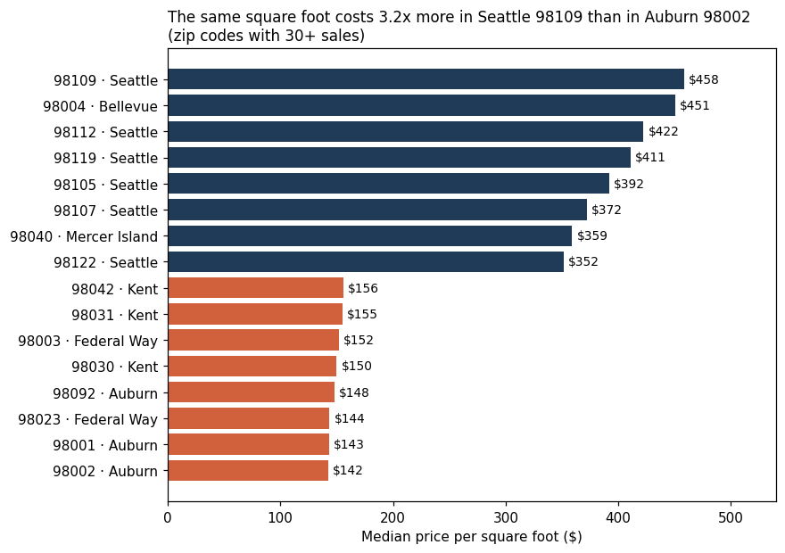
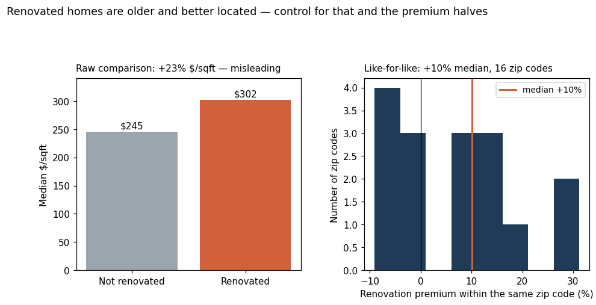
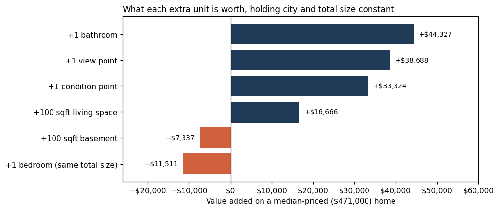
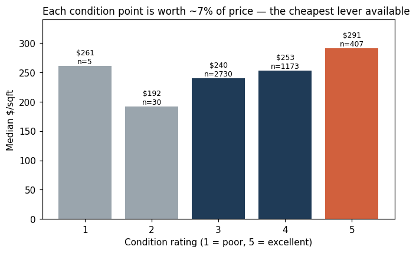
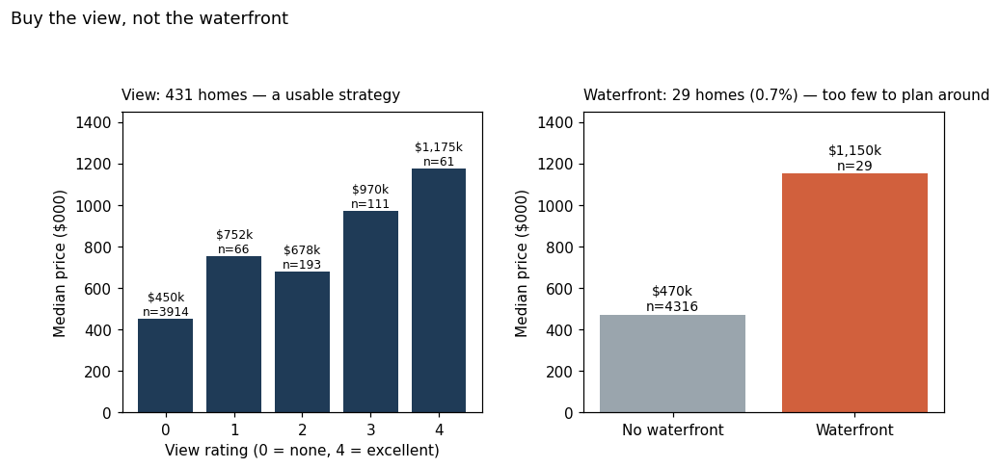
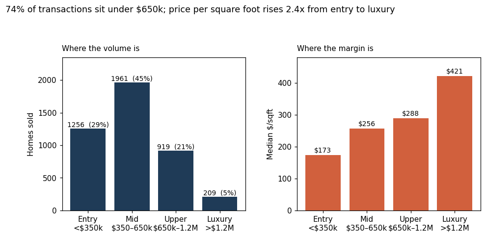

# Where to Buy, What to Fix, What to Skip

**Seven recommendations for a residential investment portfolio in King County, Washington**

Esraa Maamoun · 9 August 2026
Based on 4,345 verified home sales, May–July 2014

---

## How to read this

Every recommendation below is one sentence you can act on, one chart, and one number.
No statistics vocabulary is required. Where a number is less certain than it looks, I say so —
those caveats are the most valuable part of this document.

The single measure used throughout is **price per square foot**: the sale price divided by the
living area. It is the only fair way to compare a 1,400 sqft house in Auburn with a 3,000 sqft
house in Bellevue. Comparing raw prices would just tell us that big houses cost more.

---

## 1. Location is not one factor among many — it is the market

**The identical square foot of house costs 3.2 times more in north Seattle than in Auburn, 30 miles south.**

**The number: $458 vs $142 per square foot.**

A 2,000 sqft home costs roughly **$290,000 in Auburn and $628,000 in Seattle** — same house, same
year, different pin on the map. Before we evaluate a single property's features, we should decide
which half of this chart we are shopping in. Everything else in this report is a second-order effect
by comparison.

*Action:* Set the buy list at the zip-code level first, the property level second. Screen out
properties by zip before anyone visits a house.

---

## 2. Renovation pays — but only half as much as the raw numbers claim

**Renovated homes sell for 23% more per square foot, but most of that gap is because renovated homes happen to be older and in better neighbourhoods; the true like-for-like premium is about 10%.**

**The number: +10%, not +23%.**

This is the most important correction in the report. The median renovated home in our data is **74
years old** and the median unrenovated one is **37** — and old homes cluster in the expensive
established neighbourhoods of central Seattle. So the raw comparison is really measuring location,
not renovation. When I compare renovated against unrenovated homes *inside the same zip code* (16
zip codes had enough of both), the premium falls to a median of **+10%**, and in 6 of those 16 zip
codes it was negative.

**What that means for a budget:** on a median $471,000 home, a 10% uplift is about **$47,000**.
A renovation only pays back if it costs less than that — and our dataset contains no renovation
costs, so I cannot confirm it does. Treat $47,000 as the break-even, and get real contractor
quotes before committing.

*Action:* Budget renovations against a ~10% uplift, not 23%. Require a cost quote below the
break-even before approving any refurbishment.

---

## 3. Add a bathroom. Do not add a bedroom, and do not pay for basement space.

**Holding city and total floor area constant, an extra bathroom adds about $44,000 to a median home, while an extra bedroom carved out of the same floor area *subtracts* about $12,000.**

**The number: +$44,000 per bathroom.**

The bedroom result surprises people, so it's worth stating carefully: this is not "bedrooms are
bad." It is "for a fixed amount of floor space, buyers prefer fewer, larger rooms over more,
smaller ones." Chopping a 2,000 sqft house into five bedrooms instead of three makes it worth less.

Basement space behaves the same way — **100 sqft of basement is worth about $7,000 less than
nothing**, because it is 100 sqft that could have been above ground. Below-grade square footage is
not equivalent to above-grade square footage, and we should never value it as if it were.

*Action:* In refurbishment scope, prioritise bathroom additions and above-grade extensions.
Reject proposals that subdivide existing rooms or finish basements as living space.

---

## 4. Condition is the cheapest lever we have

**Each one-point improvement in condition rating is associated with about 7% more value — roughly $33,000 on a median home — for a fraction of what a structural renovation costs.**

**The number: +7% per condition point, about $33,000.**

Condition ratings 1 and 2 cover only 35 homes in the whole dataset, so the bottom of this scale is
thin evidence. The reliable comparison is 3 → 4 → 5, which covers 4,310 homes. Moving a property
from condition 3 (the most common rating, 2,730 homes) to condition 4 is largely cosmetic and
maintenance work — paint, roof, fixtures, systems servicing — not construction.

*Action:* Screen the acquisition pipeline for condition-3 properties in strong zip codes. That
combination — good location, average upkeep — is where cosmetic spend converts fastest.

---

## 5. Buy the view. Do not build a strategy on waterfront.

**View rating drives a real and repeatable premium across 431 homes, whereas waterfront appears in only 29 sales — too few to plan a portfolio around, however dramatic the headline number looks.**

**The number: 29 waterfront homes — 0.7% of the market.**

The waterfront figure looks spectacular: a median of **$1,150,000 versus $470,000**, a 145%
premium. I would not put that number in front of a board without the sample size next to it.
Twenty-nine observations, spread across an entire county, cannot separate "waterfront" from
"waterfront homes are also large, well-viewed and in Mercer Island." The honest read is that
waterfront is real but unmeasurable at this sample size.

View is different: **431 homes**, a clean monotonic gradient from $450k at view 0 to $1,175k at
view 4, and about **+8% per view point** once city and size are held constant. That is something we
can systematically shop for.

*Action:* Add view rating to the acquisition screen. Treat any waterfront opportunity as a one-off
to be appraised individually, not as a category with a known premium.

---

## 6. The volume is under $650k; the margin is above it

**Three-quarters of all transactions happen below $650,000, but price per square foot rises 2.4x from the entry segment to luxury — so volume and margin are in different places and need different strategies.**

**The number: 74% of sales under $650k; $173/sqft entry vs $421/sqft luxury.**

| Segment | Homes | Share | Median $/sqft | Typical size | Where |
|---|---|---|---|---|---|
| Entry, under $350k | 1,256 | 29% | $173 | 1,465 sqft | Renton, Auburn, Kent |
| Mid, $350–650k | 1,961 | 45% | $256 | 1,910 sqft | Seattle, Issaquah, Renton |
| Upper, $650k–1.2M | 919 | 21% | $288 | 2,770 sqft | Seattle, Bellevue, Redmond |
| Luxury, above $1.2M | 209 | 5% | $421 | 3,840 sqft | Seattle, Bellevue, Mercer Island |

The luxury segment is only 209 sales in ten weeks. A portfolio built there carries **liquidity
risk** — few comparable transactions, slow exits, wide pricing uncertainty. The entry segment has
the opposite profile: 1,256 sales, fast turnover, thin margin per unit.

*Action:* Pick one deliberately. A high-volume entry strategy in the south corridor and a
low-volume luxury strategy in Bellevue/Mercer Island are different businesses with different capital
and holding-period requirements — running both without saying so is how portfolios drift.

---

## 7. Do not discount a house for being old

**Once you control for location and size, age carries no penalty at all — the "old house" discount that intuition expects simply is not in this data.**

**The number: +0.1% per year of age — statistically detectable, economically nothing.**

Older homes in this market sell for *slightly more*, not less, because age is a proxy for the
established central neighbourhoods. A 1920s Queen Anne home in 98119 is expensive because of where
it stands, not despite when it was built.

The practical consequence is a pricing trap: any valuation rule that automatically marks down
pre-1960 stock will systematically overbid on new-build suburbs and underbid on central Seattle.
Age belongs in the model as a variable — it does not belong in a manual discount rule.

*Action:* Remove any blanket age-based discount from the acquisition checklist. Screen on
condition, which is measured, rather than age, which is a proxy for location.

---

## What I would tell you not to trust

Stating limits proactively is not weakness; it is what separates an analysis from a sales pitch.

- **Ten weeks of data, one season.** All sales fall between May and July 2014. There is no
  seasonality and no market trend in this dataset. Any statement about direction of prices over
  time is outside what this data can support.
- **King County only.** These relationships will not transfer to another state, and probably not
  to another metro.
- **Location is coarse.** The dataset has no property grade and no coordinates, so location is
  captured only by city and zip code. Two houses on opposite ends of one zip code are treated as
  identical here — they are not.
- **Association, not causation.** "An extra bathroom is worth $44,000" means homes with more
  bathrooms sell for more, all else equal. It does not guarantee that *building* one returns
  $44,000. Renovation cost data would be needed to close that gap, and we do not have it.
- **The renovation and waterfront findings rest on small samples** — 213 and 29 homes respectively.
  I have flagged both above rather than burying them.

---

## The one-line summary

**Buy on location first and condition second; spend on bathrooms and above-grade space, not
bedrooms or basements; and budget renovations against a 10% uplift, not the 23% the raw numbers
advertise.**

---

*Analysis: `Notebooks/03_eda_distributions.ipynb`, `Notebooks/04_eda_relationships.ipynb`.
Data: `Data/data_clean.csv` (4,345 sales, cleaned in `Notebooks/02_cleaning.ipynb`).
Feature values in section 3 come from a log-price regression with city fixed effects (R² = 0.75).*
